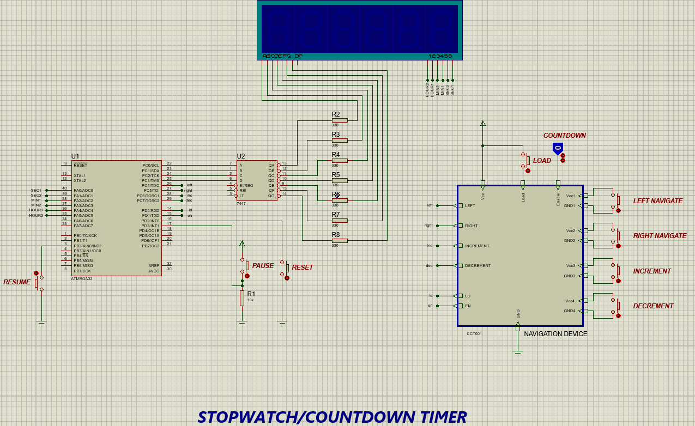

# STOPWATCH_COUNTDOWN_System_AVR
Implemented via **AVR atmega32** MCU with **1 MHz** internal clock frequency.
>### Project Description:

* By default, the system functions as a ***stopwatch*** counting ascending.
* It operates in ***countdown mode*** by setting the COUNTDOWN logic toggle to HIGH.
* In countdown mode, you can enter an initial time value using a custom **NAVIGATION** device, then pressing the **LOAD** button to start counting down.
* In **SW** mode: the **RESET** button resets the timer back to 0.
* In **CD** mode: the **RESET** button allows the user to re-enter a new initial count time.
* As long as the logic toggle is high, the device will always be in CD mode.

>### Project Simulation:

>### How to run:
* Clone the project repo via `git clone https://github.com/0marAmr/STOPWATCH_COUNTDOWN_System_AVR.git `
* Open command prompt in the project directory.
* Run `make compile` to compile project files.
* Open ***project_simulation*** file found in ***sim*** directory.
* After simulating, run `make clean` to remove compilation files.
